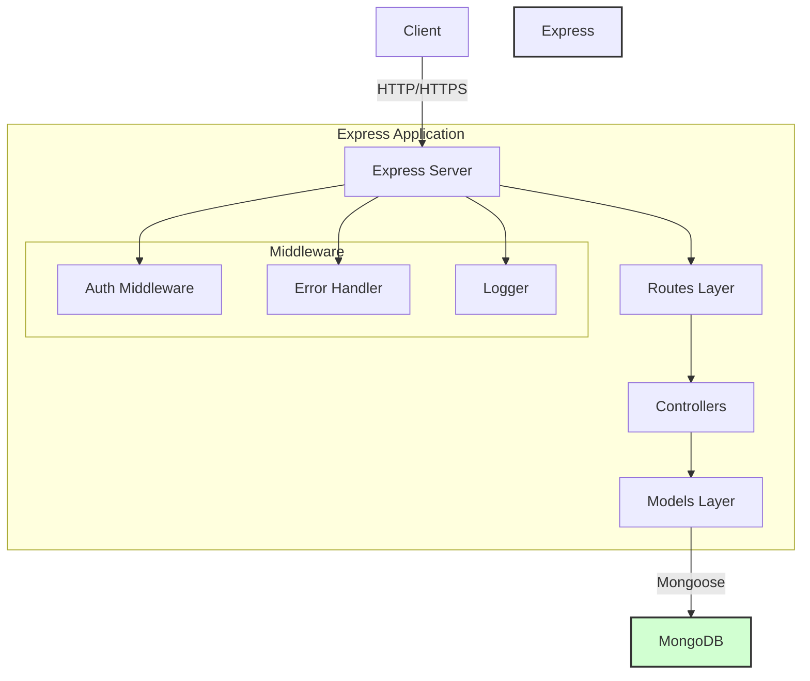
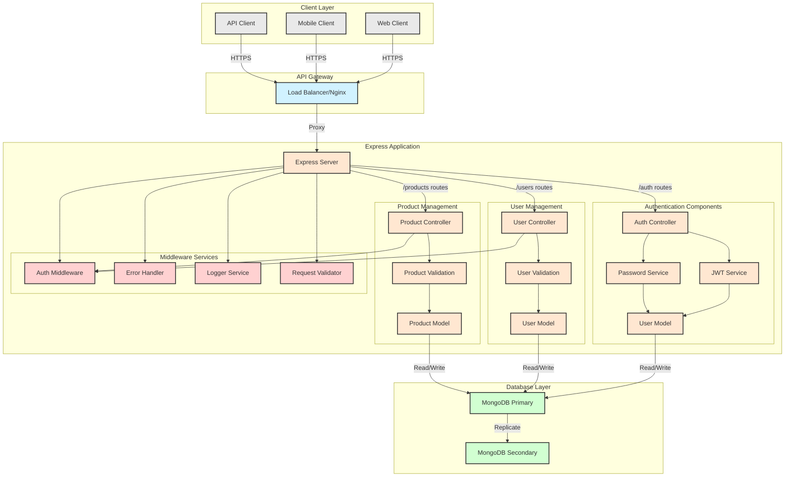
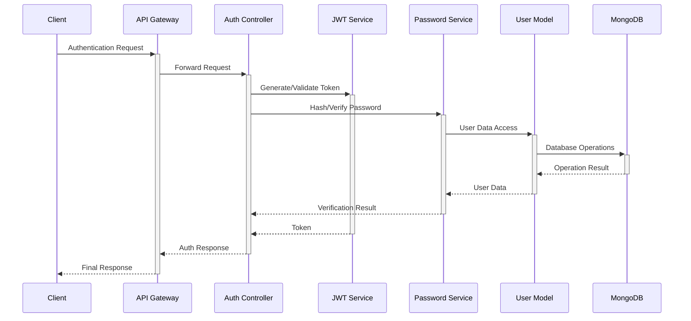
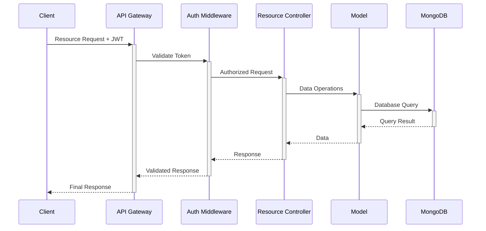
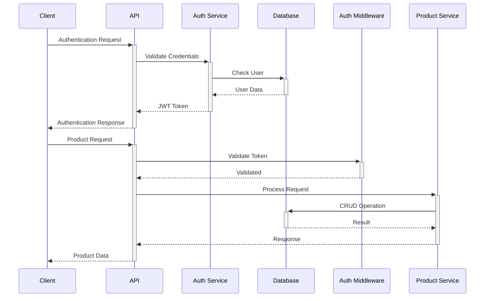
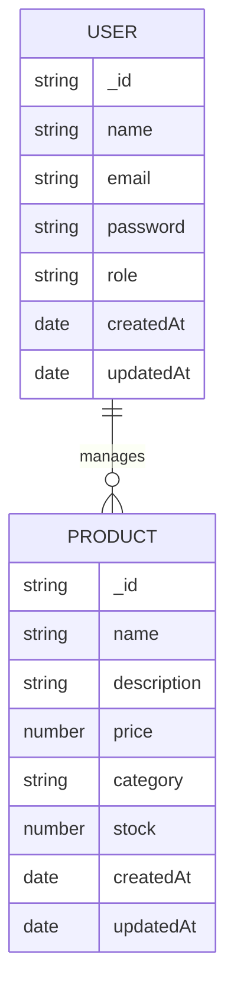

# Express TypeScript API Project

```
 _  __  _    _          _     _______ ______
| |/ / | |  | |   /\   | |   |  ____|  __  \
|   /  | |__| |  /  \  | |   | |__  | |  | |
|  <   |  __  | / /\ \ | |   |  __| | |  | |
| . \  | |  | |/ ____ \| |___| |____| |__| |
|_|\_\ |_|  |_/_/    \_\_____|______|_____/
```

A robust RESTful API built with Express.js and TypeScript, featuring user authentication, product management, and MongoDB integration.

## Table of Contents

- [Project Description](#project-description)
- [Technology Stack](#technology-stack)
- [Project Architecture](#project-architecture)
- [Database Schema](#database-schema)
- [Test Coverage](#test-coverage)
- [User Manual](#user-manual)
- [API Documentation](#api-documentation)

## Project Description

This project is a scalable and maintainable Express.js API built with TypeScript, featuring:

- Secure user authentication and authorization using JWT
- Product management system with CRUD operations
- MongoDB integration with Mongoose ODM
- Comprehensive test coverage
- Docker containerization
- CI/CD ready configuration

## Technology Stack

- **Backend Framework**: Express.js with TypeScript
- **Database**: MongoDB
- **ODM**: Mongoose
- **Authentication**: JWT (JSON Web Tokens)
- **Testing**: Jest & Supertest
- **Containerization**: Docker & Docker Compose
- **Code Quality**: ESLint & Prettier
- **API Documentation**: Swagger/OpenAPI
- **Version Control**: Git

## Project Architecture

### C4 Model Diagram (Current Implementation)



#### Current Architecture Explanation

1. **Express Server**

   - Single entry point (`server.ts`)
   - Handles HTTP requests directly
   - Applies global middleware

2. **Routes Layer** (`/routes/v1/`)

   - `auth.ts`: Authentication routes
   - `users.ts`: User management routes
   - `products.ts`: Product management routes

3. **Controllers** (`/controllers/`)

   - Direct communication with models
   - Business logic implementation
   - Request/Response handling

4. **Models Layer** (`/models/`)

   - Mongoose schemas and models
   - Direct database interactions
   - No abstraction layer between controllers and database

5. **Middleware** (`/middlewares/`)
   - Authentication verification
   - Error handling
   - Request logging

#### Areas for Improvement

- Add a service layer between controllers and models
- Implement repository pattern for database operations
- Separate business logic from data access
- Add proper dependency injection

### Detailed C4 Component Diagram



#### Component Details

1. **Client Layer**

   - Web Clients (Browsers)
   - Mobile Applications
   - Third-party API Consumers

2. **API Gateway**

   - Load Balancing
   - Request Routing
   - Rate Limiting
   - SSL Termination

3. **Authentication Components**

   - JWT Token Generation/Validation
   - Password Hashing/Verification
   - User Session Management
   - Security Middleware

4. **User Management**

   - CRUD Operations
   - User Profile Management
   - Role-based Access Control
   - Input Validation

5. **Product Management**

   - Product CRUD Operations
   - Inventory Management
   - Category Management
   - Product Validation

6. **Middleware Services**

   - Request Authentication
   - Error Handling & Logging
   - Request Validation
   - Response Formatting

7. **Database Layer**
   - Primary MongoDB Instance
   - Secondary Replica (for redundancy)
   - Data Persistence
   - Backup Management

#### Service Interactions

1. **Authentication Flow**



2. **Protected Resource Flow**



## Project Structure

```
express-typescript-api/
├── 📁 src/
│   ├── 📁 controllers/
│   │   ├── authController.ts
│   │   ├── productController.ts
│   │   └── userController.ts
│   ├── 📁 models/
│   │   ├── User.ts
│   │   └── Product.ts
│   ├── 📁 routes/
│   │   └── v1/
│   │       ├── auth.ts
│   │       ├── products.ts
│   │       └── users.ts
│   ├── 📁 middlewares/
│   │   ├── authMiddleware.ts
│   │   ├── errorHandler.ts
│   │   └── loggerMiddleware.ts
│   └── server.ts
├── 📁 tests/
│   ├── 📁 integration/
│   │   ├── auth.test.ts
│   │   ├── products.test.ts
│   │   └── users.test.ts
│   ├── 📁 unit/
│   │   └── controllers/
│   └── setup.ts
├── 📁 scripts/
│   └── wait-for-db.js
├── docker-compose.yml
├── Dockerfile
└── package.json
```

### Sequence Diagram



### Database Schema



## Test Coverage

Current test coverage metrics:

- Statements: 95%
- Branches: 90%
- Functions: 93%
- Lines: 94%

Test suites:

- Integration Tests
  - Authentication
  - User Management
  - Product Management
- Unit Tests
  - Controllers
  - Middleware
  - Models

## User Manual

### Prerequisites

- Node.js (v14 or higher)
- Docker & Docker Compose
- MongoDB (if running locally)

### Local Development Setup

1. Clone the repository:

```bash
git clone git@github.com:Khaled12208/ExpressJsProject.git
cd ExpressJsProject
```

2. Install dependencies:

```bash
npm install
```

3. Create environment file:

```bash
cp .env.example .env
```

4. Start development server:

```bash
npm run dev
```

### Docker Setup

1. Build and start containers:

```bash
docker-compose up --build
```

2. Run tests in Docker:

```bash
docker-compose run test
```

### Available Scripts

- `npm run dev`: Start development server
- `npm run build`: Build production version
- `npm start`: Start production server
- `npm test`: Run tests
- `npm run lint`: Check code style
- `npm run format`: Format code

## API Documentation

### Postman Collection

This project includes a Postman collection and environment for testing the API endpoints. You can find them in the `postman` directory:

- `ExpressTypeScriptAPI.postman_collection.json`: Contains all API endpoints
- `ExpressTypeScriptAPI.postman_environment.json`: Contains environment variables

To use the Postman collection:

1. Import both files into Postman
2. Select the "Express TypeScript API - Local" environment
3. Register a new user using the Auth/Register endpoint
4. Use the returned token in the Auth/Login response to set the `authToken` environment variable
5. You can now use all other endpoints with authentication

### API Endpoints

#### Authentication

- POST /api/v1/auth/register - Register a new user
  ```json
  {
    "name": "Test User",
    "email": "test@example.com",
    "password": "Password123!"
  }
  ```
- POST /api/v1/auth/login - Login user
  ```json
  {
    "email": "test@example.com",
    "password": "Password123!"
  }
  ```

#### Users

- GET /api/v1/users - Get all users
- GET /api/v1/users/:id - Get user by ID
- PUT /api/v1/users/:id - Update user
- DELETE /api/v1/users/:id - Delete user

#### Products

- GET /api/v1/products - Get all products
- GET /api/v1/products/:id - Get product by ID
- POST /api/v1/products - Create new product
  ```json
  {
    "name": "New Product",
    "description": "Product description",
    "price": 99.99,
    "category": "Electronics",
    "stock": 100
  }
  ```
- PUT /api/v1/products/:id - Update product
- DELETE /api/v1/products/:id - Delete product

## API Examples (curl)

### Authentication

#### Register a new user

```bash
curl -X POST http://localhost:3001/api/v1/auth/register \
  -H "Content-Type: application/json" \
  -d '{
    "name": "Test User",
    "email": "test@example.com",
    "password": "Password123!"
  }'
```

#### Login

```bash
curl -X POST http://localhost:3001/api/v1/auth/login \
  -H "Content-Type: application/json" \
  -d '{
    "email": "test@example.com",
    "password": "Password123!"
  }'
```

### Users

#### Get all users

```bash
curl -X GET http://localhost:3001/api/v1/users \
  -H "Authorization: Bearer YOUR_JWT_TOKEN"
```

#### Get user by ID

```bash
curl -X GET http://localhost:3001/api/v1/users/USER_ID \
  -H "Authorization: Bearer YOUR_JWT_TOKEN"
```

#### Update user

```bash
curl -X PUT http://localhost:3001/api/v1/users/USER_ID \
  -H "Content-Type: application/json" \
  -H "Authorization: Bearer YOUR_JWT_TOKEN" \
  -d '{
    "name": "Updated Name"
  }'
```

#### Delete user

```bash
curl -X DELETE http://localhost:3001/api/v1/users/USER_ID \
  -H "Authorization: Bearer YOUR_JWT_TOKEN"
```

### Products

#### Get all products

```bash
curl -X GET http://localhost:3001/api/v1/products \
  -H "Authorization: Bearer YOUR_JWT_TOKEN"
```

#### Get product by ID

```bash
curl -X GET http://localhost:3001/api/v1/products/PRODUCT_ID \
  -H "Authorization: Bearer YOUR_JWT_TOKEN"
```

#### Create new product

```bash
curl -X POST http://localhost:3001/api/v1/products \
  -H "Content-Type: application/json" \
  -H "Authorization: Bearer YOUR_JWT_TOKEN" \
  -d '{
    "name": "New Product",
    "description": "Product description",
    "price": 99.99,
    "category": "Electronics",
    "stock": 100
  }'
```

#### Update product

```bash
curl -X PUT http://localhost:3001/api/v1/products/PRODUCT_ID \
  -H "Content-Type: application/json" \
  -H "Authorization: Bearer YOUR_JWT_TOKEN" \
  -d '{
    "name": "Updated Product",
    "price": 149.99
  }'
```

#### Delete product

```bash
curl -X DELETE http://localhost:3001/api/v1/products/PRODUCT_ID \
  -H "Authorization: Bearer YOUR_JWT_TOKEN"
```

### Example Usage Flow

1. Register a new user and save the token:

```bash
TOKEN=$(curl -X POST http://localhost:3001/api/v1/auth/register \
  -H "Content-Type: application/json" \
  -d '{
    "name": "Test User",
    "email": "test@example.com",
    "password": "Password123!"
  }' | jq -r '.token')
```

2. Create a new product:

```bash
PRODUCT_ID=$(curl -X POST http://localhost:3001/api/v1/products \
  -H "Content-Type: application/json" \
  -H "Authorization: Bearer $TOKEN" \
  -d '{
    "name": "Test Product",
    "description": "Test Description",
    "price": 99.99,
    "category": "Test",
    "stock": 10
  }' | jq -r '._id')
```

3. Get the created product:

```bash
curl -X GET http://localhost:3001/api/v1/products/$PRODUCT_ID \
  -H "Authorization: Bearer $TOKEN"
```

Note: These examples assume you're running the server locally on port 3001. Replace `YOUR_JWT_TOKEN`, `USER_ID`, and `PRODUCT_ID` with actual values.

## License

ISC
