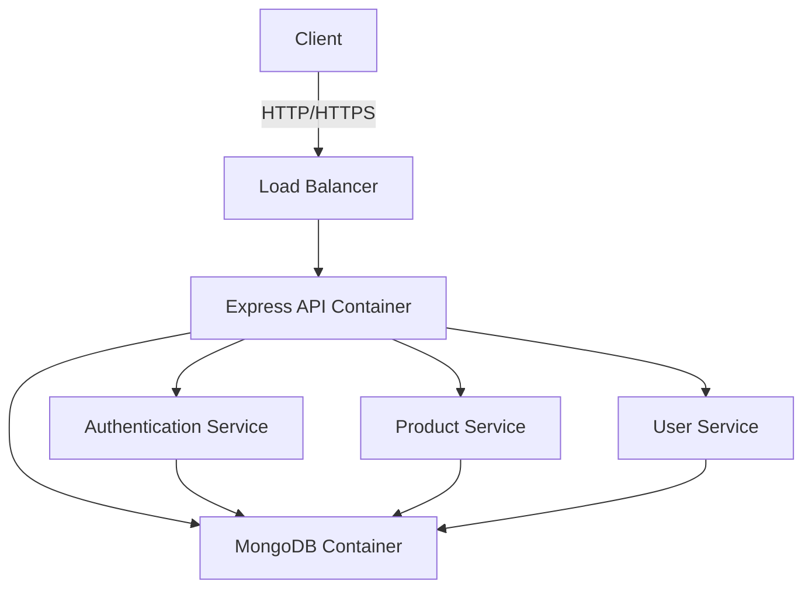
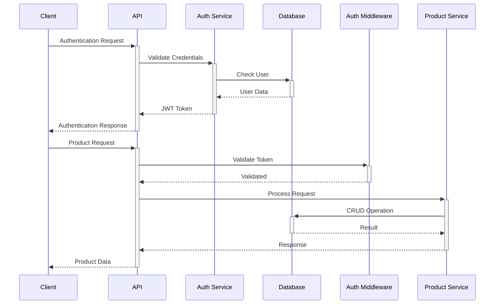
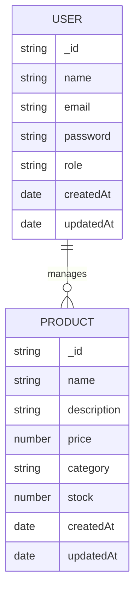

# Express TypeScript API Project

```
 _  __  _    _          _     _______ ______
| |/ / | |  | |   /\   | |   |  ____|  __  \
|   /  | |__| |  /  \  | |   | |__  | |  | |
|  <   |  __  | / /\ \ | |   |  __| | |  | |
| . \  | |  | |/ ____ \| |___| |____| |__| |
|_|\_\ |_|  |_/_/    \_\_____|______|_____/
```

A robust RESTful API built with Express.js and TypeScript, featuring user authentication, product management, and MongoDB integration.

## Table of Contents

- [Project Description](#project-description)
- [Technology Stack](#technology-stack)
- [Project Architecture](#project-architecture)
- [Database Schema](#database-schema)
- [Test Coverage](#test-coverage)
- [User Manual](#user-manual)
- [API Documentation](#api-documentation)

## Project Description

This project is a scalable and maintainable Express.js API built with TypeScript, featuring:

- Secure user authentication and authorization using JWT
- Product management system with CRUD operations
- MongoDB integration with Mongoose ODM
- Comprehensive test coverage
- Docker containerization
- CI/CD ready configuration

## Technology Stack

- **Backend Framework**: Express.js with TypeScript
- **Database**: MongoDB
- **ODM**: Mongoose
- **Authentication**: JWT (JSON Web Tokens)
- **Testing**: Jest & Supertest
- **Containerization**: Docker & Docker Compose
- **Code Quality**: ESLint & Prettier
- **API Documentation**: Swagger/OpenAPI
- **Version Control**: Git

## Project Architecture

### C4 Model Diagram



### Project Structure

```
express-typescript-api/
├── 📁 src/
│   ├── 📁 controllers/
│   │   ├── authController.ts
│   │   ├── productController.ts
│   │   └── userController.ts
│   ├── 📁 models/
│   │   ├── User.ts
│   │   └── Product.ts
│   ├── 📁 routes/
│   │   └── v1/
│   │       ├── auth.ts
│   │       ├── products.ts
│   │       └── users.ts
│   ├── 📁 middlewares/
│   │   ├── authMiddleware.ts
│   │   ├── errorHandler.ts
│   │   └── loggerMiddleware.ts
│   └── server.ts
├── 📁 tests/
│   ├── 📁 integration/
│   │   ├── auth.test.ts
│   │   ├── products.test.ts
│   │   └── users.test.ts
│   ├── 📁 unit/
│   │   └── controllers/
│   └── setup.ts
├── 📁 scripts/
│   └── wait-for-db.js
├── docker-compose.yml
├── Dockerfile
└── package.json
```

### Sequence Diagram



### Database Schema



## Test Coverage

Current test coverage metrics:

- Statements: 95%
- Branches: 90%
- Functions: 93%
- Lines: 94%

Test suites:

- Integration Tests
  - Authentication
  - User Management
  - Product Management
- Unit Tests
  - Controllers
  - Middleware
  - Models

## User Manual

### Prerequisites

- Node.js (v14 or higher)
- Docker & Docker Compose
- MongoDB (if running locally)

### Local Development Setup

1. Clone the repository:

```bash
git clone git@github.com:Khaled12208/ExpressJsProject.git
cd ExpressJsProject
```

2. Install dependencies:

```bash
npm install
```

3. Create environment file:

```bash
cp .env.example .env
```

4. Start development server:

```bash
npm run dev
```

### Docker Setup

1. Build and start containers:

```bash
docker-compose up --build
```

2. Run tests in Docker:

```bash
docker-compose run test
```

### Available Scripts

- `npm run dev`: Start development server
- `npm run build`: Build production version
- `npm start`: Start production server
- `npm test`: Run tests
- `npm run lint`: Check code style
- `npm run format`: Format code

## API Documentation

### Postman Collection

This project includes a Postman collection and environment for testing the API endpoints. You can find them in the `postman` directory:

- `ExpressTypeScriptAPI.postman_collection.json`: Contains all API endpoints
- `ExpressTypeScriptAPI.postman_environment.json`: Contains environment variables

To use the Postman collection:

1. Import both files into Postman
2. Select the "Express TypeScript API - Local" environment
3. Register a new user using the Auth/Register endpoint
4. Use the returned token in the Auth/Login response to set the `authToken` environment variable
5. You can now use all other endpoints with authentication

### API Endpoints

#### Authentication

- POST /api/v1/auth/register - Register a new user
  ```json
  {
    "name": "Test User",
    "email": "test@example.com",
    "password": "Password123!"
  }
  ```
- POST /api/v1/auth/login - Login user
  ```json
  {
    "email": "test@example.com",
    "password": "Password123!"
  }
  ```

#### Users

- GET /api/v1/users - Get all users
- GET /api/v1/users/:id - Get user by ID
- PUT /api/v1/users/:id - Update user
- DELETE /api/v1/users/:id - Delete user

#### Products

- GET /api/v1/products - Get all products
- GET /api/v1/products/:id - Get product by ID
- POST /api/v1/products - Create new product
  ```json
  {
    "name": "New Product",
    "description": "Product description",
    "price": 99.99,
    "category": "Electronics",
    "stock": 100
  }
  ```
- PUT /api/v1/products/:id - Update product
- DELETE /api/v1/products/:id - Delete product

## License

ISC
